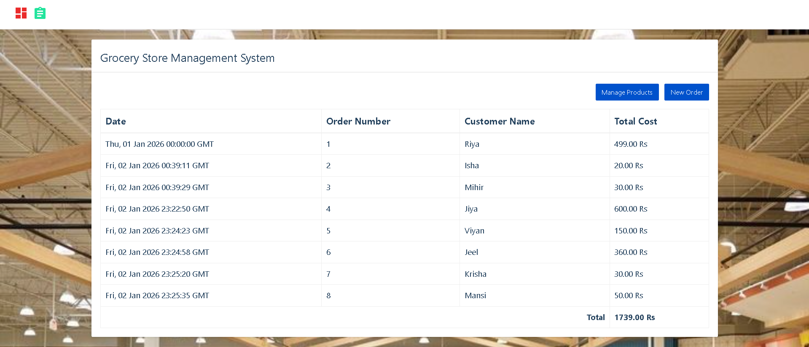
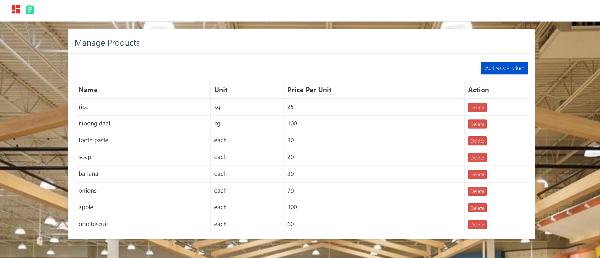
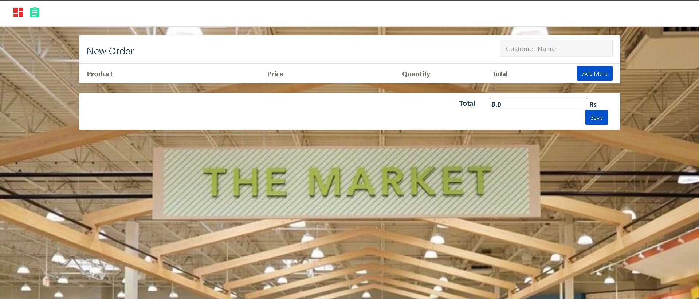

# 🛒 Grocery Store Management Web Application

A **3‑tier Grocery Store Management System** built using **Python (Flask)**, **MySQL**, and **HTML/CSS/JavaScript (Bootstrap)**. This project allows store staff to manage products, units of measurement, and customer orders through a clean web interface.

---

## Project Overview

This application follows a **3‑tier architecture**:

1. **Frontend (UI)**: HTML, CSS, JavaScript, Bootstrap
2. **Backend**: Python, Flask REST APIs
3. **Database**: MySQL


## Application Screenshots

### Home Page – Orders Dashboard

Displays all placed orders with date, order number, customer name, and total cost.



---

### Manage Products Page

Allows viewing, adding, and deleting grocery products along with unit and price per unit.



---

### 🧾 New Order Page

Used to create a new customer order by selecting products, quantities, and calculating totals.



---

##  Installation & Setup

###  Install MySQL (Windows)

Download and install MySQL:
[https://dev.mysql.com/downloads/installer/](https://dev.mysql.com/downloads/installer/)

Create a database named (example):

```
grocery_store
```

---

###  Install Python Dependencies

```bash
pip install flask
pip install mysql-connector-python
pip install flask-cors
```

---

### Configure Database Connection

Edit `sql_connection.py`:

```python
mysql.connector.connect(
    host="localhost",
    user="root",
    password="YOUR_PASSWORD",
    database="grocery_store"
)
```

---

###  Run the Application

```bash
python server.py
```

Open UI using **Live Server** or browser:

```
http://127.0.0.1:5500/ui/index.html
```

---

## Features

###  Products Module

* View all products
* Add new products
* Delete products
* Display unit of measurement (UOM)

###  Orders Module

* Create new orders
* Add multiple products per order
* Auto calculation of total price
* View order history

---

##  Future Enhancements

The system is functional, but the following improvements can be implemented:

1. **Orders Module – Validation**

   * Validate customer name
   * Validate quantity and product selection (Frontend only)

2. **Orders Module – Bug Fix**

   * Fix issue where manually changing item total does not update the grand total

3. **Orders Module – View Order Details**

   * Add a **View** button to show detailed order items

---

##  Learning Outcomes

* Understanding of 3‑tier architecture
* REST API development using Flask
* Frontend–Backend integration
* MySQL database handling
* Real‑world CRUD operations

---

## 👩‍💻 Author

**Riya Makwana**


---

⭐ If you like this project, give it a star on GitHub!
